# Shop Express

<b>ShopExpress is an e-commerce shopping app that allows users to browse and purchase products from
their mobile devices. With a wide range of products organized into categories, users can easily explore
the catalog, view product details, and add items to their cart. The app offers a secure checkout process,
user account management, notifications, search functionality, ratings and reviews, and a wishlist feature. ShopExpress aims to provide a user-friendly and convenient shopping experience for customers, simplifying the process of buying products online.</b>

## Technology Used

- Flutter
- Dart
- GetX
- Firebase Storage
- Firebase Authentication
- Firebase Firestore

## Installation

### Prerequisites

<b>Flutter:</b> Ensure you have Flutter installed on your development machine. You can find installation instructions at flutter.dev.

### Getting Started

<b>1. Clone the Shop Express repository to your local machine.</b>

```
https://github.com/Anand-s-FlutterLab/Shop-Express.git
```

<b>2. Install the project dependencies using Flutter's package manager, pub.</b>

```
flutter pub get
```

<b>3. Build and run the Flutter app on your preferred platform (iOS or Android).</b>

```
flutter run
```

## Features

<b>The Shop Express offers a range of features, including:</b>
- Login
- Signup
- Forgot Password
- Search Product by Category
- Search Product by Name
- Favorites
- Cart
- Checkout
- Order History
- Profile Update
- Save Address and Credit Card

<b>The Shop Express offers a range of features for admin, including:</b>
- Product Management
- Item Slider Management
- Add New Product

## Screenshots

<p align="center">
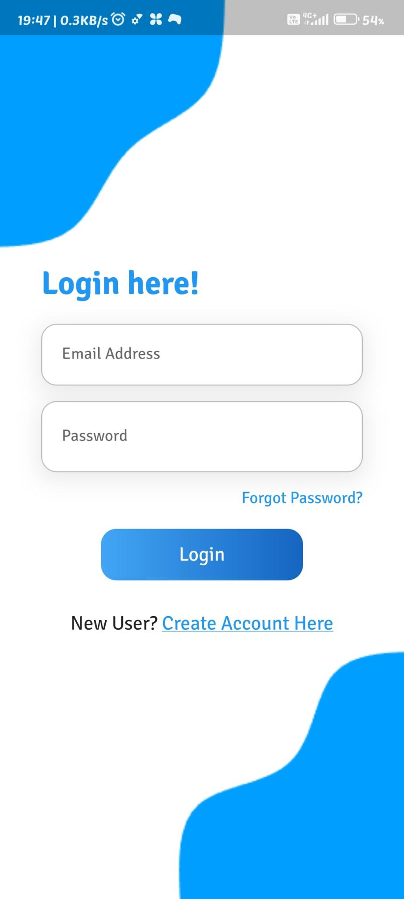
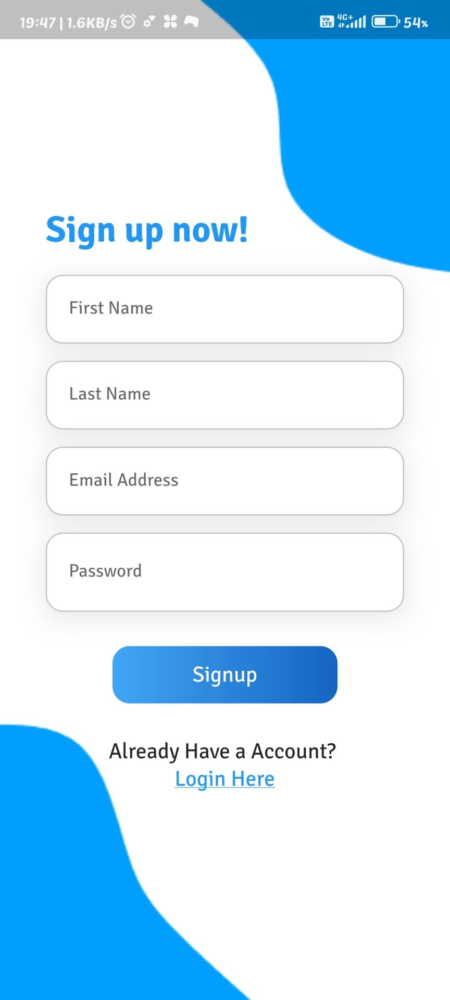
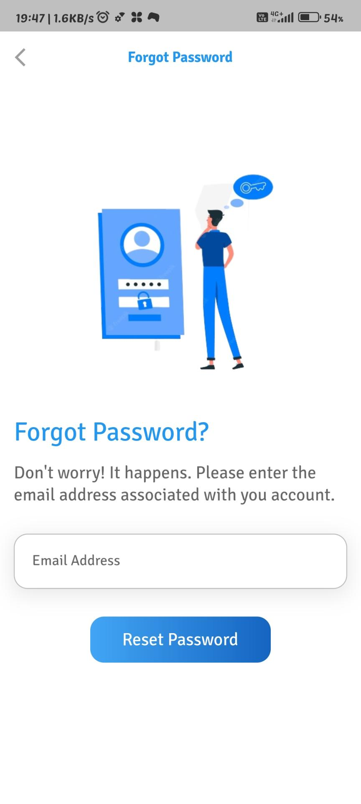
</p>
<br>
<p align="center">
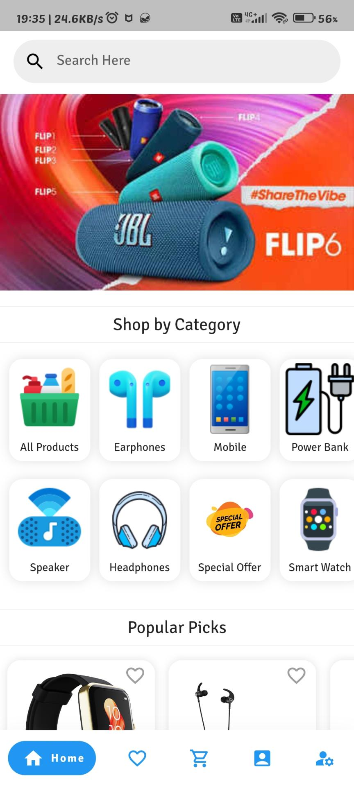
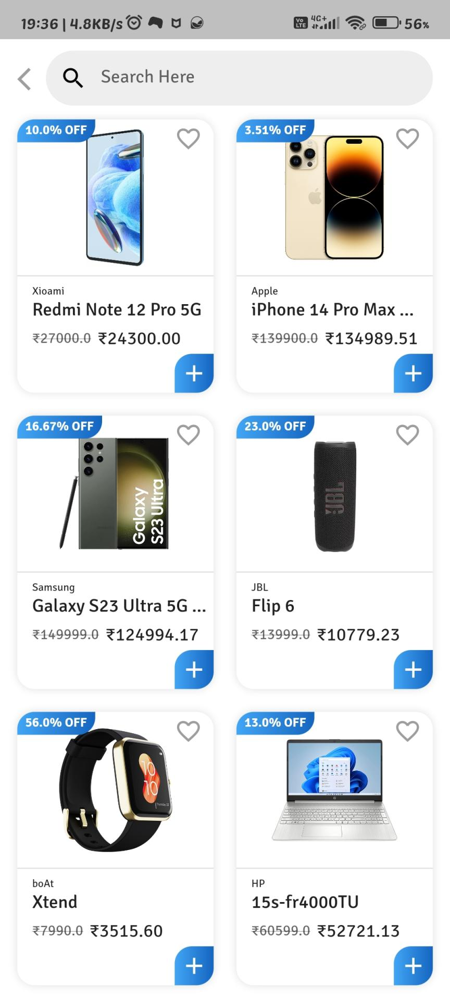
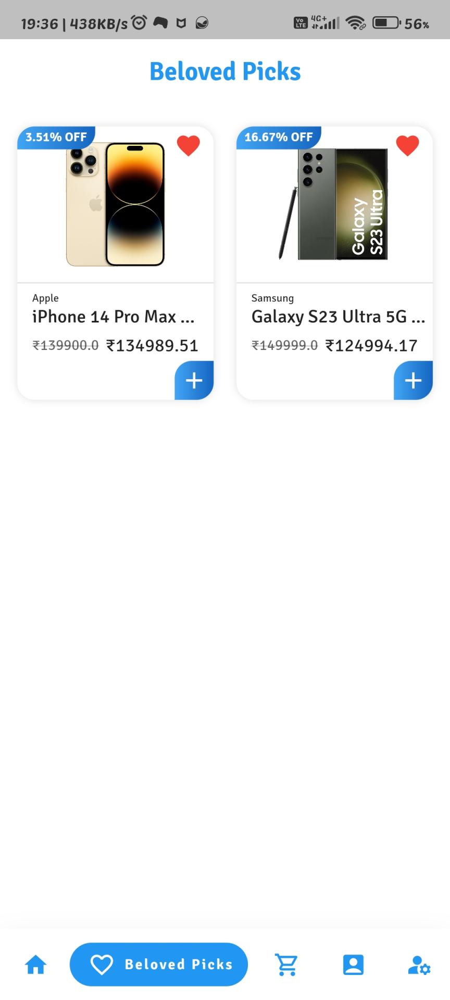
</p>
<br>
<p align="center">
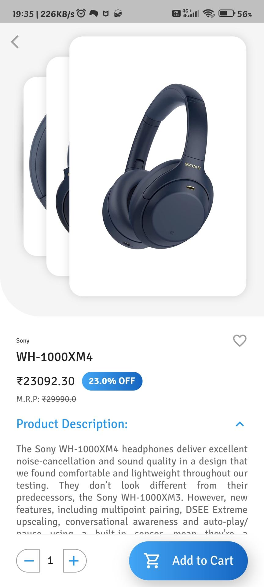
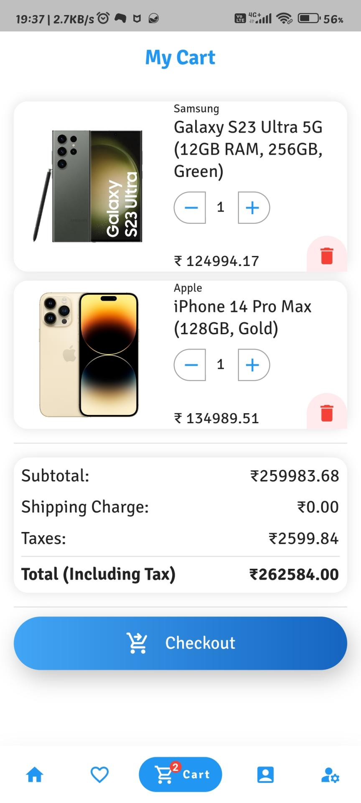
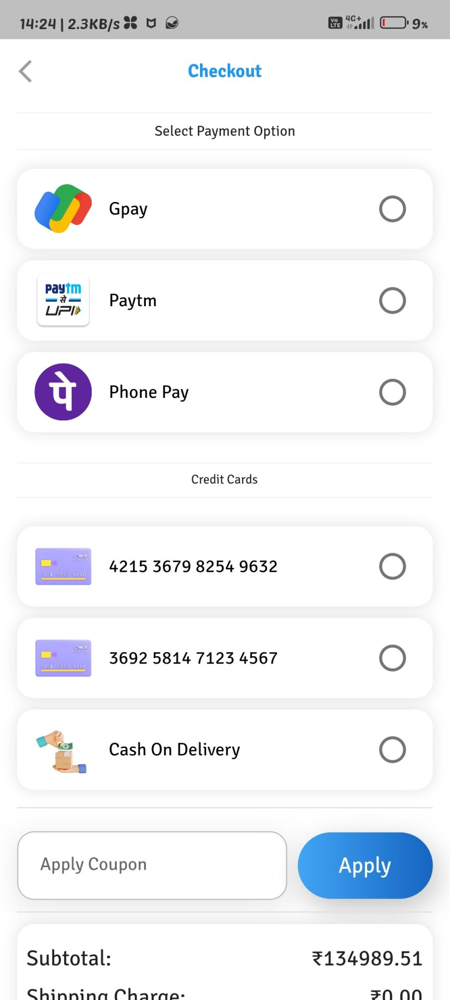
</p>
<br>
<p align="center">
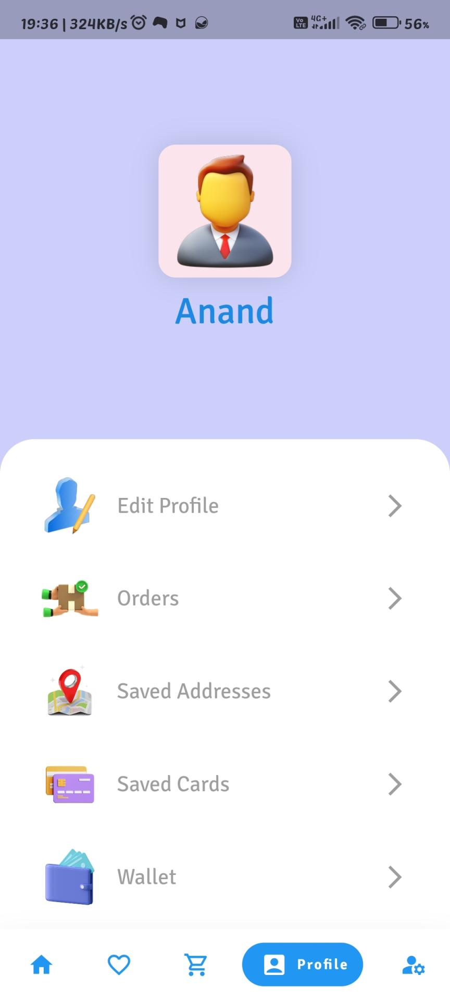
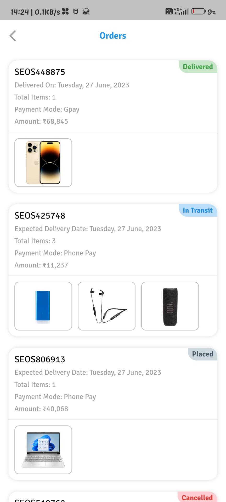
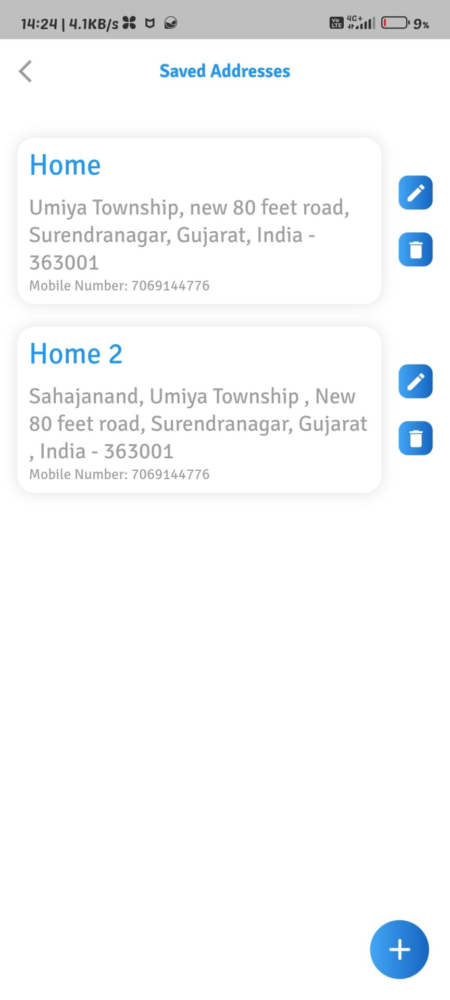
</p>
<br><p align="center">
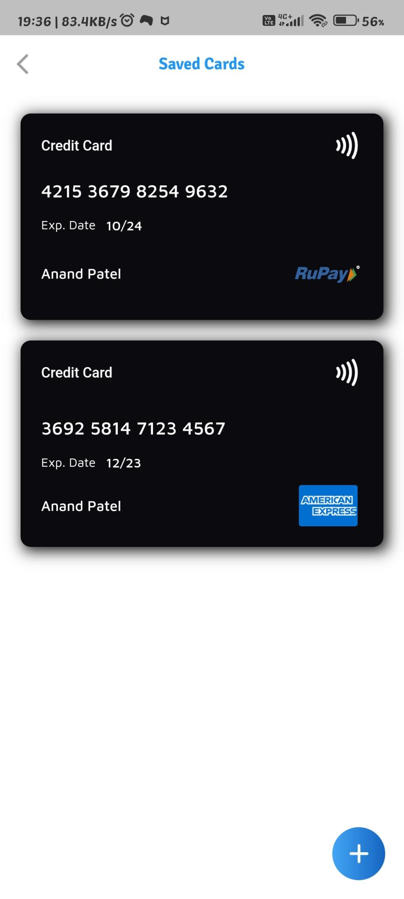
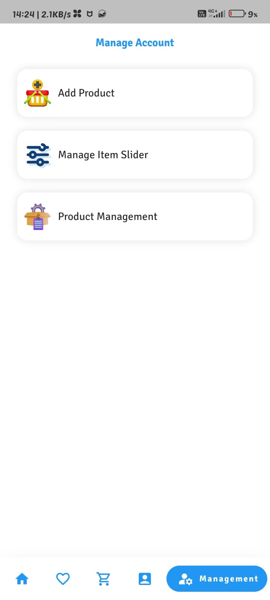
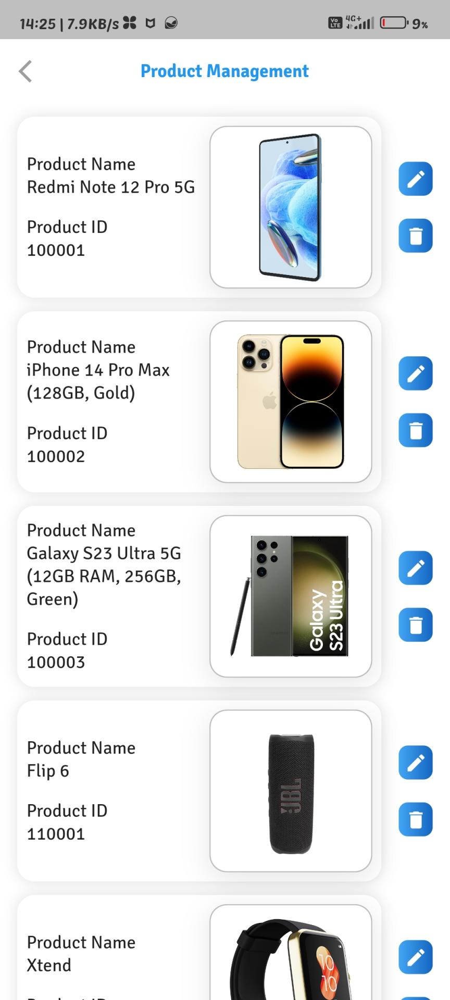
</p>
<br>